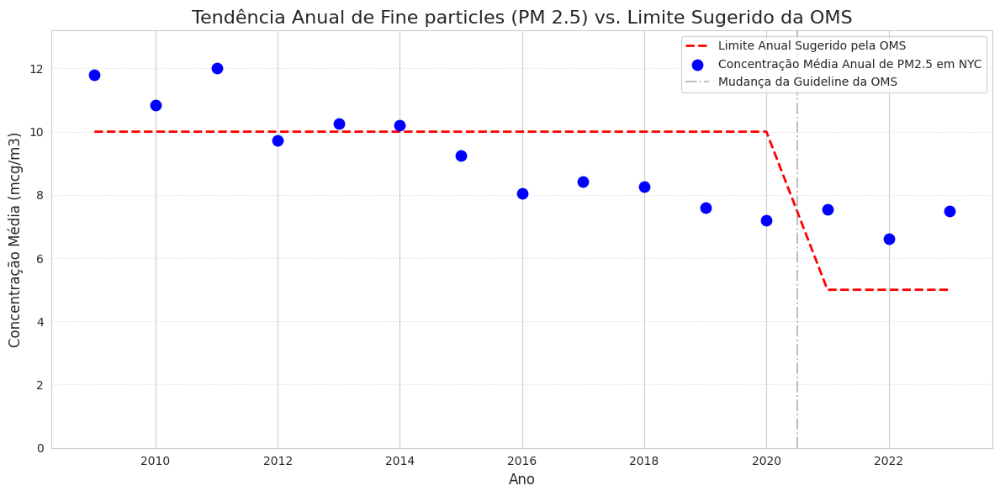
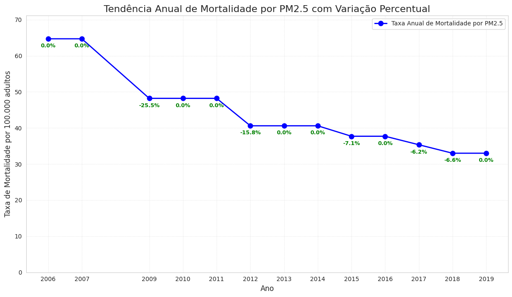

# 3 - Análise Exploratória e Consultas SQL

### Primeira Consulta

Essa consulta mostraria os anos em que a distribuição anual de PM2.5 em NYC
está dentro dos limites sugeridos pela OMS (10 µg/m³ até 2020 e 5 µg/m³ a partir
de 2021). Porém para mostrar os pontos num gráfico, não estamos filtrando fora os
anos que não atendem a esses critérios por um motivo de visualização.

```sql
SELECT *
FROM (
    SELECT IndicatorID, Name, Year, avg(DataValue) as DataValue
    FROM df_seasonal
    GROUP BY IndicatorID, Name, Year
    HAVING IndicatorID = 365 -- PM2.5
)
WHERE 
 	(Year BETWEEN 2005 AND 2020 AND DataValue <=10)
        or
    (Year >= 2021 AND DataValue <=5)
ORDER BY Year
```

Referência: https://www.who.int/news-room/feature-stories/detail/what-are-the-who-air-quality-guidelines \
Último Acesso em 14/11/25 23:59



### Segunda Consulta

Distribuição de Dióxido de Nitrogênio (NO2) ao longo dos anos por estação utilizando a medida de partes por bilhão (ppb)

```sql
SELECT Season, Year, DataValue
FROM df_seasonal
WHERE IndicatorID = 375 -- NO2
```


## Terceira Consulta

Taxa de variação de mortes devido ao PM 2.5 ao longo dos anos

```sql
SELECT
    Year, DataValue,
    LAG(DataValue, 1) OVER (ORDER BY Year) AS DataValue_Anterior,
    (
        (DataValue - LAG(DataValue, 1) OVER (ORDER BY Year)) / 
        DataValue_Anterior
    ) * 100 AS Decrescimo_Percentual
FROM df_annual
WHERE IndicatorId = 639 -- Mortes devido ao PM2.5
ORDER BY Year
```


## Aplicação da Hipotése 1

H1: "Haverá uma correlação negativa significativa entre o período do ano e a poluição
do ar"

Hipotése aplicada à PM2.5 e Dióxido de Nitrogênio (NO2)

Resultado: Hipótese totalmente falha, a hipótese se mostrou tendo uma correlação positiva entre o verão e o inverno pata o PM2.5 quanto para o NO2.

| Poluente | Coeficiente r | P-valor | Significância ($\mathbf{P < 0.05}$) |
| :--- | :--- | :--- | :--- |
| PM2.5 | 0.695 | 0.00406 | Sim |
| NO2 | 0.765| 0.00090 | Sim |

## Aplicação da Hipótese 2

H2: "O período passado é um bom preditor para dizer se a poluição do ar vai subir
ou diminuir no próximo ano"

Hipótese aplicada na maior resolução de dados possível para o conjunto enquanto fazendo uso de lag=1, isso significa que temos resultados para o verão/inverno de PM2.5, verão/inverno de NO2 e verão para O3.

Resultados nos mostraram a possibilidade de utilizar regressão para fazer a correlação para todos indicadores exceto para o ozônio, o qual não mostrou correlação nenhuma com o mesmo período anterior.

| Poluente | Estação | Coeficiente r | P-valor | Conclusão |
| :--- | :--- | :--- | :--- | :--- |
| PM2.5 | Verão | 0.682 | 0.00724 | Significativa ($\mathbf{P < 0.05}$) |
| PM2.5 | Inverno | 0.630 | 0.01583 | Significativa ($\mathbf{P < 0.05}$) |
| NO2| Verão | 0.934 | 0.00000 | Altamente Significativa ($\mathbf{P \ll 0.001}$) |
| NO2 | Inverno | 0.730 | 0.00702 | Significativa ($\mathbf{P < 0.05}$) |
| O3 | Anual | 0.085 | 0.77211 | Não Significativa |

## Aplicação da Hipótese 3

H3: "A concentração anual de PM2.5 apresenta uma relação maior com os indicadores de mortalidade do que com indicadores de morbidade"

Resultado: Podemos analisar que a taxa de mortalidade é consideravelmente maior do que morbidades para o PM2.5.

Indicador de Saúde | Coeficiente r | P-valor | Significância ($\mathbf{P < 0.05}$) | Conclusão da Relação |
| :--- | :--- | :--- | :--- | :--- |
| Mortalidade | 0.944 | 0.00001 | Altamente Significativa | Relação Extremamente Forte |
| Emergências de Asma | 0.927 | 0.00004 | Altamente Significativa | Relação Extremamente Forte |
| Hospitaliz. Respiratórias | 0.850 | 0.00093 | Altamente Significativa | Relação Forte |
| Hospitaliz. Cardiovasculares | 0.634 | 0.03611 | Significativa | Relação Moderada |